---             
title: Upgrading my home network by converting existing phone lines to Ethernet
excerpt: Speeding up local network by shifting from wireless to dedicated backhaul, and overkill?
modified:       
tags: [hardware, networks, homelab]        
image:          
    path: /images/articles/home-network/2024-05-18-upgrade-internet-from-phone-to-ethernet-25.png
    thumbnail: /images/articles/home-network/2024-05-18-upgrade-internet-from-phone-to-ethernet-2.png
date: 2024-05-18
---             

This article documents my journey in upgrading my home network. Currently, my home network relies on a Wifi mesh router which communicates wirelessly via a band (also known as a dedicated wireless backhaul). The understanding is that it doesn't use the existing bands that 2.4Ghz and 5GHz devices rely on, ensuring the speed doesn't suffer.

## TL;DR

I watched a few videos that inspired me to go re-cabling my phone jacks, and found that indeed, wired is always better than wireless, and if you're lucky you can upgrade without replacing any in-wall cables. Second takeaway is your network is as fast as the weakest link, so look everywhere to understand what the bottleneck might be. Also, Cat5E can go faster than the rated 1Gbps despite common myth it cannot, if your hardware supports it. Scroll down to see speed comparisions! As bonus I added a 2.5GbE switch and I have super fast home networking now.

### Background

What started as a simple youtube video I saw back in March became a project to upgrade my home network infrastructure[^1]. Initially, after being inspirted by the video, and in an effort to see if I can reduce some ugly wiring from the internet service providers fiber to the home (FTTH) unit, I went down the rabbit hole and it became an effort to improve my home networks performance. 

While the existing setup was sufficient for my internet speeds and streaming, I often wondered if we can do better! Why? Well, I'm a nerd for these kinds of things, and a more aesthetic look around the house with less wiring is always welcomed. Also, who uses physical phone and phone jacks these days? (If I really wanted, I could still do VoIP!). Plus, thinking big, maybe I can run Moonlight game streaming from my PC downstairs to my entertainment room upstairs? Cue the neverending overkill that homelabbing can be.

## Today/Existing setup

I have two Linksys Tri-band Mesh Routers which are Wifi 5 [link](https://www.linksys.com/support-product?sku=WHW0303). With my internet service provider, the FTTH (fiber to the home) unit connects to one of these routers on the first floor, and the other router sits on the second floor to have whole home coverage. 

I have a home server setup which is hard wired to the router upstairs. (I used to have a college laptop repurposed server downstairs too, but later retired it and used a Rock5 SBC instead). Both routers communicate wirelessly. While the internet plan I have does not hit gigabit speeds (because I am frugal and our household does not require it), local file transfers can be optimized!

```
ISP --> FTTH/ONT (living room) --> Mesh Router (living room, ethernet)
                                    |--> Mesh Router (upstairs, wireless) 
                                          |---> Server (Rock5 SBC, ethernet)
```

Checking `http://192.168.1.1/sysinfo.cgi` on the router, I can see that there's no interface ~~for the backhaul (thanks [reddit](https://www.reddit.com/r/LinksysVelop/comments/okqxnu/how_can_i_tell_my_devices_are_connected_to_a/))~~. I later realized this is incorrect, even when plugged in it doesn't accurately reflect if it's using wireless or wired backhaul. Rather the speeds will tell the story.

```
sysevent get backhaul::status
up
sysevent get icc_internet_state
up
sysevent get backhaul::intf

sysevent get backhaul::media
0
```

My understanding of networks is that if I can get a dedicated backhaul, my latencies between my server and devices will be further reduced, and files copies are going to be much faster over wired ethernet than wireless. Or, even if both devices are wireless, not using one of the bands to communicate between mesh routers should yield a performance increase in network transfer, at least in theory. So let's be data driven, let's use `iperf` and run a few benchmarks to see if this is true.

(Yes I realize there might be bottlenecks elsewhere, and in networks, the slowest device or cable is the weakest link. However, I'm concerned about the end to end experience for now so let's gooo)

## Testing Wireless backhaul Set-up

- Device: 
    - Client - Laptop, Acer Chromebook 516 (using Wifi)
    - Server - Rock5 SBC I have running as my server, with NVME storage. (Ethernet port of mesh router)
- Backhaul Connection Type: Wireless

### Test: iperf

I was going to go all [dockerized](https://hub.docker.com/r/mlabbe/iperf3) in my testing but the binary is smol enough and not intrusive I figured it's 'closer to the metal' to run on the host itself. Although a call out here is the ChromeOS' Linux development environment is actually virtualized.

```
rhea:~:% iperf3 -s
-----------------------------------------------------------
Server listening on 5201
-----------------------------------------------------------
```

On my laptop:

```
leewc@penguin:$ iperf3 -c 192.168.1.2
Connecting to host 192.168.1.2, port 5201
[  5] local 100.115.92.201 port 35224 connected to 192.168.1.2 port 5201
[ ID] Interval           Transfer     Bitrate         Retr  Cwnd
[  5]   0.00-1.00   sec  13.4 MBytes   112 Mbits/sec    0    814 KBytes       
[  5]   1.00-2.00   sec  17.6 MBytes   148 Mbits/sec    0   1.63 MBytes       
[  5]   2.00-3.00   sec  16.2 MBytes   136 Mbits/sec    0   2.44 MBytes       
[  5]   3.00-4.00   sec  16.2 MBytes   136 Mbits/sec    0   3.15 MBytes       
[  5]   4.00-5.00   sec  16.2 MBytes   136 Mbits/sec    0   3.15 MBytes       
[  5]   5.00-6.00   sec  15.0 MBytes   126 Mbits/sec    0   3.15 MBytes       
[  5]   6.00-7.00   sec  15.0 MBytes   126 Mbits/sec    0   3.15 MBytes       
[  5]   7.00-8.00   sec  17.5 MBytes   147 Mbits/sec    0   3.15 MBytes       
[  5]   8.00-9.00   sec  16.2 MBytes   136 Mbits/sec    0   3.15 MBytes       
[  5]   9.00-10.00  sec  8.75 MBytes  73.3 Mbits/sec    0   3.15 MBytes       
- - - - - - - - - - - - - - - - - - - - - - - - -
[ ID] Interval           Transfer     Bitrate         Retr
[  5]   0.00-10.00  sec   152 MBytes   128 Mbits/sec    0             sender
[  5]   0.00-10.25  sec   150 MBytes   123 Mbits/sec                  receiver
```

And the server also indicates similar results

```
Accepted connection from 192.168.1.7, port 35214
[  5] local 192.168.1.2 port 5201 connected to 192.168.1.7 port 35224
[ ID] Interval           Transfer     Bitrate
[  5]   0.00-1.00   sec  11.6 MBytes  97.3 Mbits/sec                  
[  5]   1.00-2.00   sec  16.6 MBytes   139 Mbits/sec                  
[  5]   2.00-3.00   sec  16.4 MBytes   137 Mbits/sec                  
[  5]   3.00-4.00   sec  16.0 MBytes   134 Mbits/sec                  
[  5]   4.00-5.00   sec  16.1 MBytes   135 Mbits/sec                  
[  5]   5.00-6.00   sec  15.4 MBytes   129 Mbits/sec                  
[  5]   6.00-7.00   sec  14.8 MBytes   125 Mbits/sec                  
[  5]   7.00-8.00   sec  17.2 MBytes   144 Mbits/sec                  
[  5]   8.00-9.00   sec  16.4 MBytes   138 Mbits/sec                  
[  5]   9.00-10.00  sec  9.20 MBytes  77.2 Mbits/sec                  
[  5]  10.00-10.25  sec  19.8 KBytes   641 Kbits/sec                  
- - - - - - - - - - - - - - - - - - - - - - - - -
[ ID] Interval           Transfer     Bitrate
[  5]   0.00-10.25  sec   150 MBytes   123 Mbits/sec                  receiver
```

If this is your first time reading and understanding results (it is for me), the last part is what matters for us here, in `0-10.24 seconds`, `iperf3` transferred `150 MBytes` at a bitrate of `123 Mbits/sec`. iperf3 also defaults to TCP. I wasn't sure why it didn't report bandwidth a `Mbps` but it turns out because it doesn't know exactly how TCP will segment the traffic, so [it can't report how much](https://stackoverflow.com/questions/74709974/why-when-i-use-iperf3-at-ubuntu-between-client-server-it-mesaured-the-bitrate-an) 'bandwidth' is being consumed.

I also ran the test with more parallel streams (gotcha: it's `-P` for parallel count and `-p` for port, I kept getting connection refused when I did `iperf3 -c 192.168.1.2 -p 4` as it's trying to connect via port number 4)

With parallel `4`:

```
- - - - - - - - - - - - - - - - - - - - - - - - -
[ ID] Interval           Transfer     Bitrate         Retr
[  5]   0.00-10.00  sec  38.8 MBytes  32.5 Mbits/sec   15             sender
[  5]   0.00-10.13  sec  37.5 MBytes  31.0 Mbits/sec                  receiver
[  7]   0.00-10.00  sec  38.2 MBytes  32.1 Mbits/sec   16             sender
[  7]   0.00-10.13  sec  36.6 MBytes  30.3 Mbits/sec                  receiver
[  9]   0.00-10.00  sec  42.4 MBytes  35.5 Mbits/sec   43             sender
[  9]   0.00-10.13  sec  40.0 MBytes  33.1 Mbits/sec                  receiver
[ 11]   0.00-10.00  sec  40.0 MBytes  33.6 Mbits/sec   29             sender
[ 11]   0.00-10.13  sec  38.3 MBytes  31.7 Mbits/sec                  receiver
[SUM]   0.00-10.00  sec   159 MBytes   134 Mbits/sec  103             sender
[SUM]   0.00-10.13  sec   152 MBytes   126 Mbits/sec                  receiver
```

Interesting, looks like `retr` shows we have some retransmitted packets during the test with 4 threads.

### Test: Ping

Quick ping test for latency

```
ping 192.168.1.2    
...
--- 192.168.1.2 ping statistics ---
15 packets transmitted, 15 received, 0% packet loss, time 14025ms
rtt min/avg/max/mdev = 7.281/9.743/13.996/1.900 ms
```

### Test: Download a file from Plex Server

As a real-world test, I downloaded a file from my server. 


That's a stable 13.2 MB/s.

Now, with the same setup, but rather than wireless everything, the laptop (client) is connected via ethernet to the mesh router downstairs. Note this is still leveraging a *wireless* backhaul between 2 mesh routers.

### Test: Ping with client hardwired connection (wireless backhaul)

```

15 packets transmitted, 15 received, 0% packet loss, time 14025ms
rtt min/avg/max/mdev = 5.033/6.344/8.748/1.036 ms
```

### Test: `iperf` with client hardwired connection

```
leewc@penguin:~/dev/leewc.github.io$ iperf3 -c 192.168.1.2
Connecting to host 192.168.1.2, port 5201
[  5] local 100.115.92.201 port 47624 connected to 192.168.1.2 port 5201
[ ID] Interval           Transfer     Bitrate         Retr  Cwnd
[  5]   0.00-1.00   sec  23.5 MBytes   197 Mbits/sec    0   1.30 MBytes       
[  5]   1.00-2.00   sec  32.5 MBytes   273 Mbits/sec    0   2.90 MBytes       
[  5]   2.00-3.00   sec  28.8 MBytes   241 Mbits/sec    0   3.14 MBytes       
[  5]   3.00-4.00   sec  21.2 MBytes   178 Mbits/sec    0   3.14 MBytes       
[  5]   4.00-5.00   sec  21.2 MBytes   178 Mbits/sec    0   3.14 MBytes       
[  5]   5.00-6.00   sec  27.5 MBytes   231 Mbits/sec    0   3.14 MBytes       
[  5]   6.00-7.00   sec  28.8 MBytes   241 Mbits/sec    0   3.14 MBytes       
[  5]   7.00-8.00   sec  27.5 MBytes   231 Mbits/sec    0   3.14 MBytes       
[  5]   8.00-9.00   sec  25.0 MBytes   210 Mbits/sec    0   3.14 MBytes       
[  5]   9.00-10.00  sec  31.2 MBytes   262 Mbits/sec    0   3.14 MBytes       
- - - - - - - - - - - - - - - - - - - - - - - - -
[ ID] Interval           Transfer     Bitrate         Retr
[  5]   0.00-10.00  sec   267 MBytes   224 Mbits/sec    0             sender
[  5]   0.00-10.16  sec   267 MBytes   220 Mbits/sec                  receiver
```

With parallel `4`:

```
- - - - - - - - - - - - - - - - - - - - - - - - -
[ ID] Interval           Transfer     Bitrate         Retr
[  5]   0.00-10.00  sec  61.8 MBytes  51.8 Mbits/sec    0             sender
[  5]   0.00-10.43  sec  61.7 MBytes  49.7 Mbits/sec                  receiver
[  7]   0.00-10.00  sec  57.2 MBytes  48.0 Mbits/sec    0             sender
[  7]   0.00-10.43  sec  57.1 MBytes  46.0 Mbits/sec                  receiver
[  9]   0.00-10.00  sec  57.6 MBytes  48.3 Mbits/sec    0             sender
[  9]   0.00-10.43  sec  57.6 MBytes  46.4 Mbits/sec                  receiver
[ 11]   0.00-10.00  sec  61.6 MBytes  51.7 Mbits/sec    0             sender
[ 11]   0.00-10.43  sec  61.6 MBytes  49.6 Mbits/sec                  receiver
[SUM]   0.00-10.00  sec   238 MBytes   200 Mbits/sec    0             sender
[SUM]   0.00-10.43  sec   238 MBytes   192 Mbits/sec                  receiver

iperf Done.
```

### Test: File download with client hardwired connection


Interestingly not much better! I was expecting at least 20+ MB/s after reviewing the results from `iperf3`, which was a nice jump in bitrate from 123Mbits to 220Mbits on a single thread but it never topped out there.

So it looks like the wireless backhaul of my router is pretty good as it is for streaming, and downloads, or at least good enough it doesn't warrant me to go plug in my laptop and sit next to the router!

**Armed with these benchmarks as a baseline, it's time to upgrade!**

## How to Upgrade

From the youtube video and many deep dives, it appears that many homes already have ethernet wiring, but perhaps due to the year the house was built (ours was 2000s), when phones were still prevalent, many home builders provided a phone jack, and for many American homes, a coaxial cable for cable internet and cable TV.

Opening up one of the wall face plate would quickly tell you if you can do it, you should see an ethernet cable (most probably Cat5 or Cat5e) with only 2 wires connected to the phone jack!

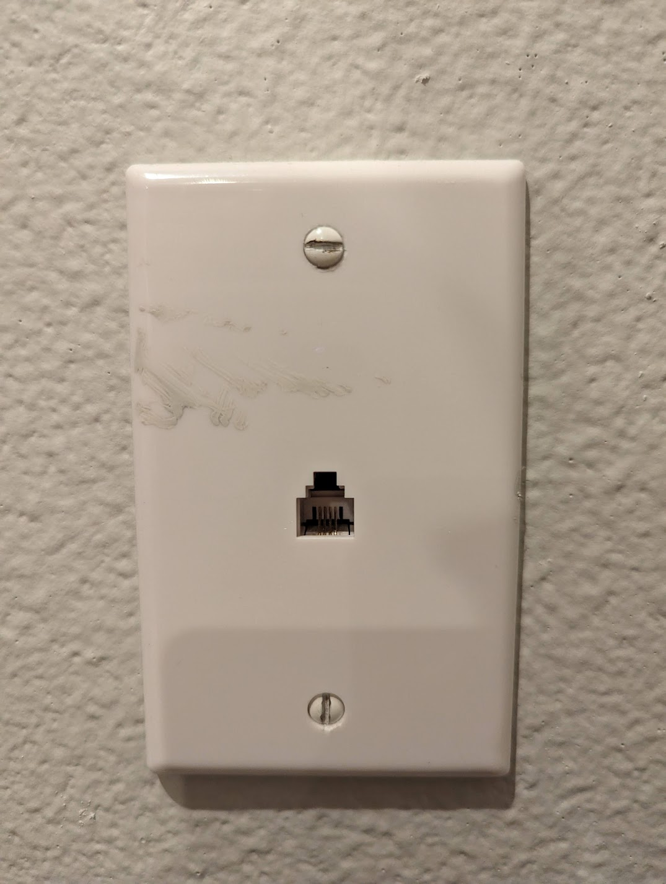

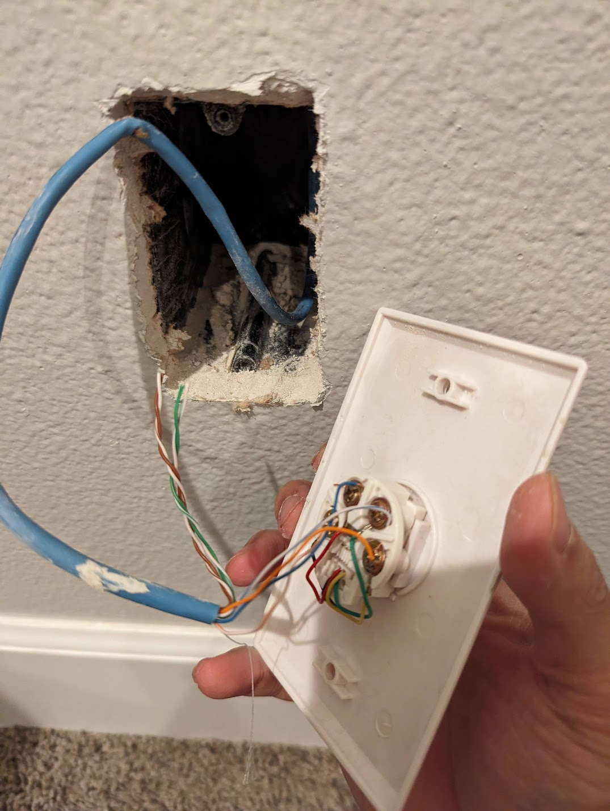

Note if you're not as lucky like in the photo above, there's some setups where it's daisy chained, [sample pic](https://imgur.com/xfaZ81H) from [reddit](https://www.reddit.com/r/HomeNetworking/comments/wbj922/how_to_convert_telephone_ethernet_via_daisy_chain/), making this upgrade harder.   I would probably not proceed if that's the case for you, as it involves replacing the cabling and often-times the cables are stapled down so you can't fish a new line through. There is a suggestion of breaking the daisy chain and installing a switch at each location as alluded to in this [Reddit post](https://www.reddit.com/r/HomeNetworking/comments/ltu0aa/if_you_have_daisy_chained_cat5_cables_meant_for/), but at that point, you might as well use the wireless backhaul and build your homelab in a way that physically keeps everything close by, and doesn't rely on the existing home wiring. It might be better to also just be smart around hiding wires externally below the carpet or crown moulding. 

Moving on, your second step is **to find where all these cables go to and terminate at**, typically it's in a storage room below the stairs, attic, or garage. In my case, it's a weird white box I thought was for the home alarm system right behind the door of my washer and dryer room!

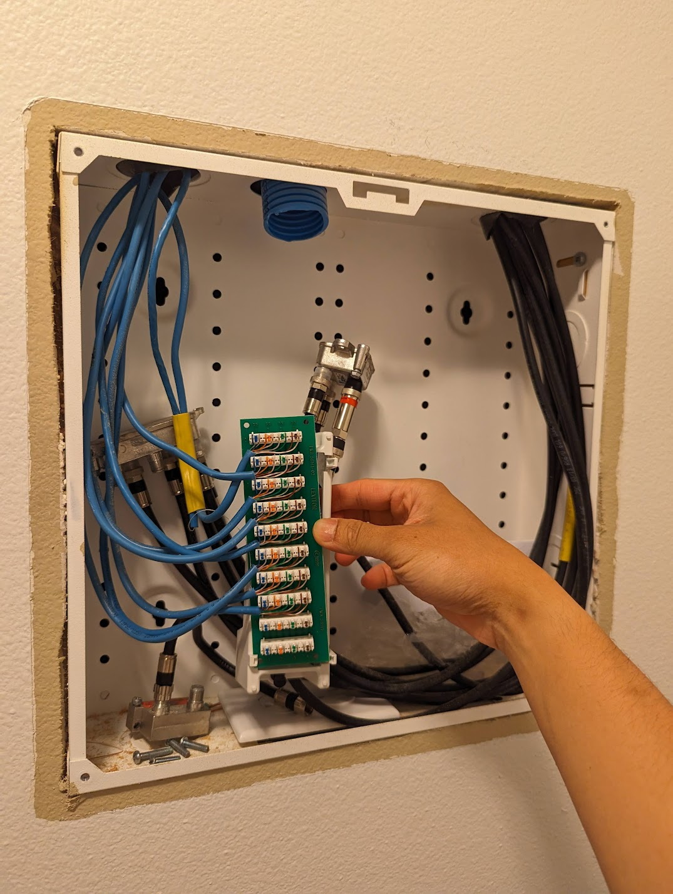

Above, this 'structured media enclosure' shows me holding a PWB 58141, which has the punch downs for telephony. We will have to switch this out for Ethernet.

### Bill of Materials

A couple things I needed, you can look them up if you're    interested:

For each room with an RJ45 outlet:
- Faceplates to replace a phone jack, as they are now RJ45 jacks
  - Some of these existing jacks are just a single phone jack, but most have a coax input as well. You can either buy the faceplates that come with the keystone jacks, or buy blanks like me and separate keystone jacks to save some $.
- Keystone jacks for RJ45, which we'll terminate.

For the structured media enclosure:
- A patch panel
  - This will replace the punch down in the media enclosure for telephony.
    - Pro-tip: You might be tempted to buy a Leviton brand one so it fits all nicely, or whatever is sold at your nearest hardware store, but I recommend just buying what you like + fits your budget. Let's be practical, I ain't dropping $50 for an original one when other brands sell it for $10. No one will care about the brand of patch panel you used except yourself (and maybe the further buyer of your home).
- Keystone jacks for the patch panel if they're blank like mine.
   - Note: While you might be tempted to just directly terminate the ends with RJ45 heads, it's not best practice as it can be loose or tugged around, causing a connection to drop.

For cabling and terminating each run
- Punch down knife tool: Used for pushing in the copper wire into the keystone jack
- Multiple RJ45 heads/plugs 
  - You need this unless you want to buy specific lengths of cabling. You can re-terminate existing longer cables you may have  
- Crimp tool: Used to terminate each cable head, skip this if you're just buying cables.
- A cable tester 
  - I almost decided against this because I will probably not need to do this project again, but so glad I bought one. It was the only surefire way to test that my wire pin-outs are correct and each wire is properly terminated. I had a few instances where I messed up the color scheme or the wire was brittle and not terminated properly. Messing even one wire up out of the 8 will reduce rated speed from 1Gbps down to 100Mbps. A cheapo one will work fine.

All in all I think I spent around $50 for parts.

### Upgrade

Over the course of a weekend or two and a few days, I spent time terminating and upgrading each end. Your thumbs will feel sore so take your time and be mentally ready.

The process is easy in theory. 

1. Cut off the old termination on each end. 

2. Install RJ45 jacks by terminating it according a standard ethernet wiring code (I used T568B as it seems more common for home wiring) on both ends.
- 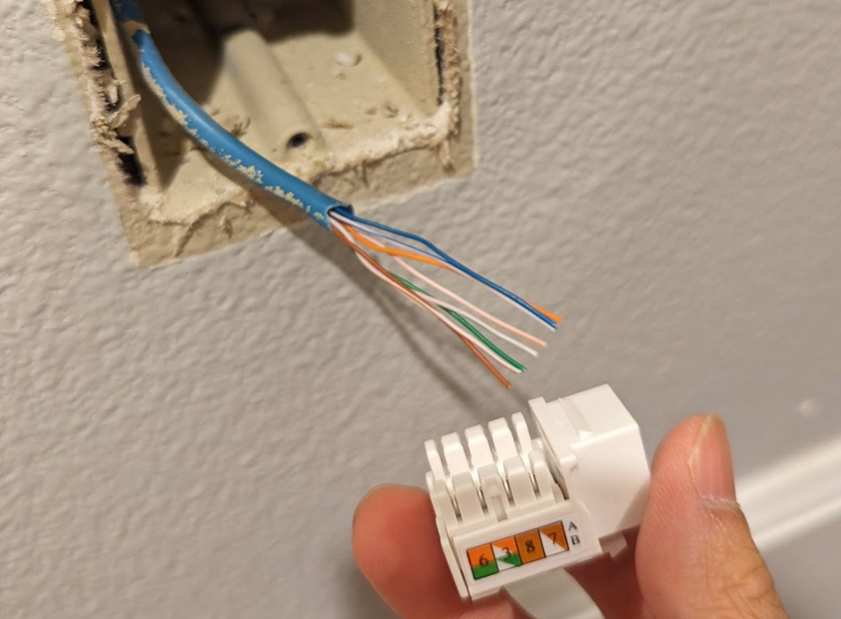 
3. Punch down
- 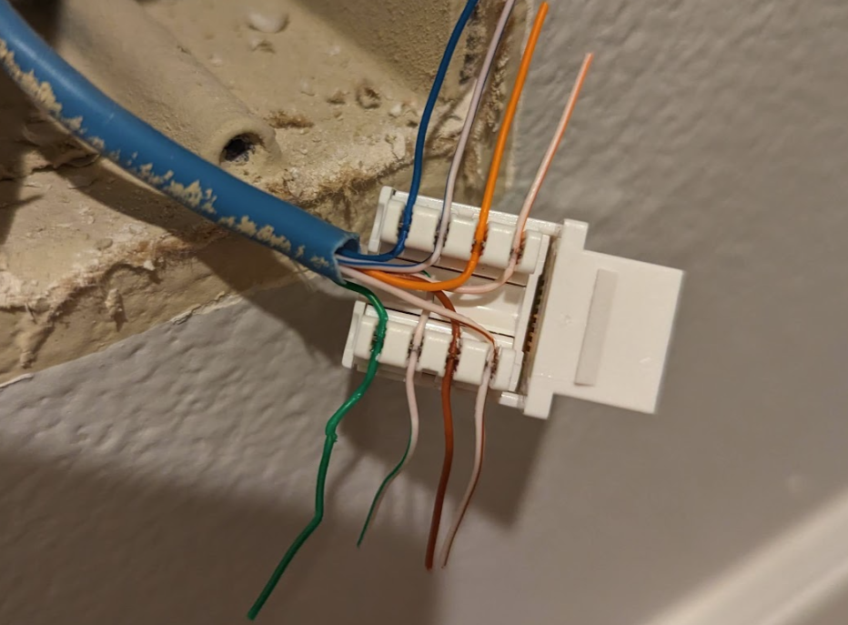
4. Repeat the other side (the media enclosure)
5. Test your termination with a cable tester.
- 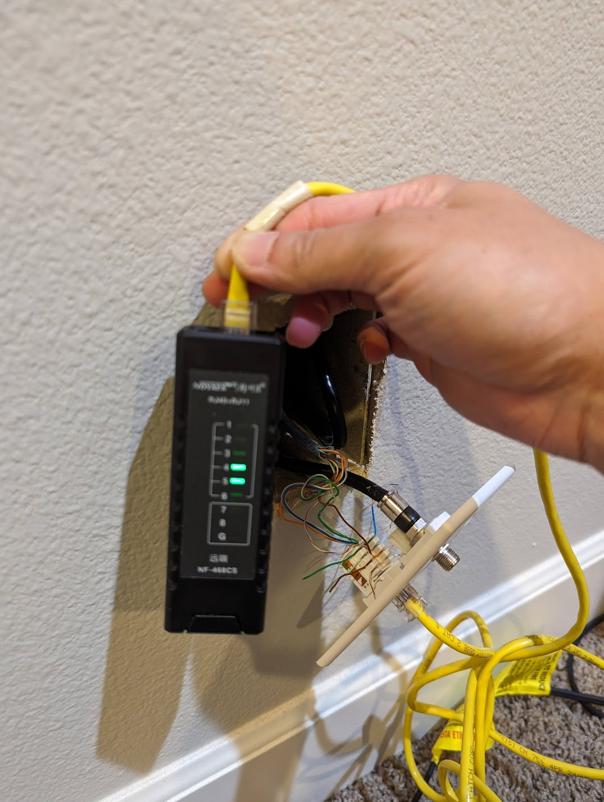
- 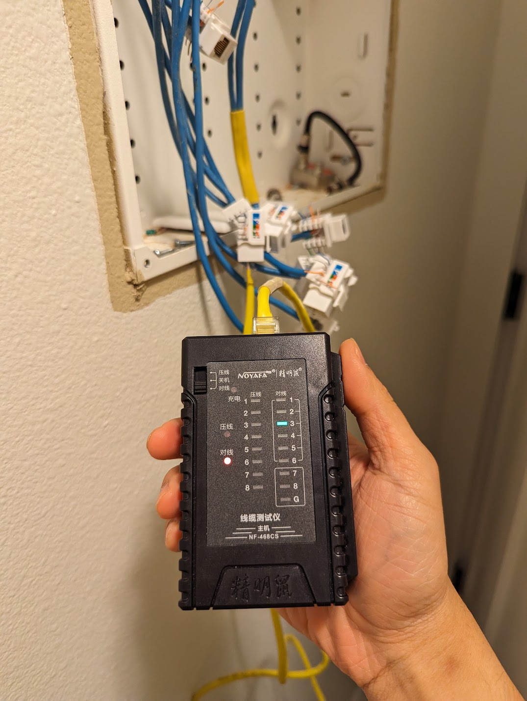

If all goes well, you'll see the lights show up in sequence. If you messed something up, the lights will not show up in sequence and you'll have to re-terminate. The previous setup also did not label which room is which, so I took this opportunity and used the cable tester to check and label them!

My fingers hurt after doing all 8 rooms, since I had to do it both sides, it is 16x in total... and having to cut my own cables, I did this basically 32x. I also kind of memorized the pin outs.


I vaguely remember doing this when I was 9 in a computer class.

I also had to do some cabling for the patch panel after:

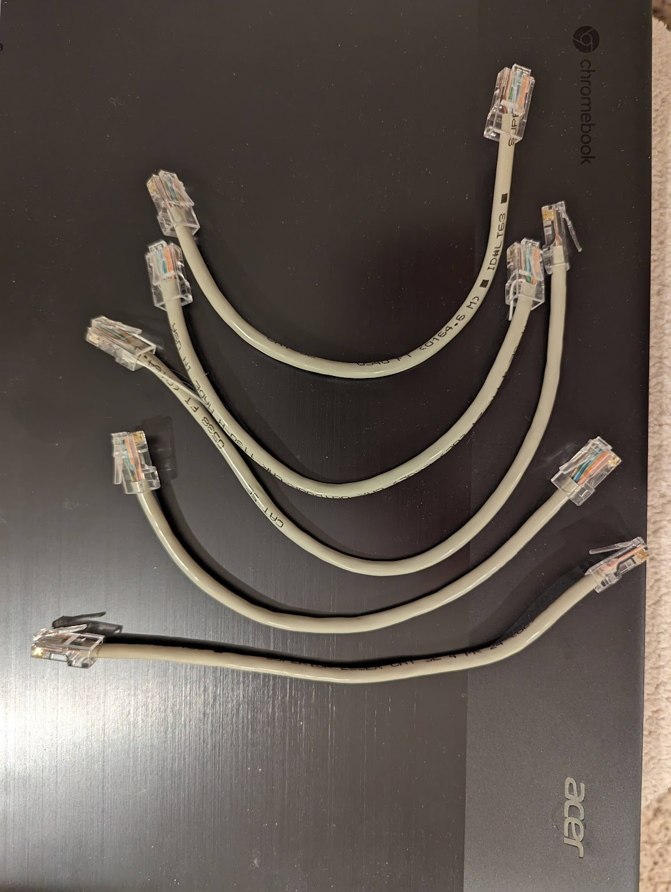


One interesting point to note is that I had trouble finding the last cable run. There were 9 in total in that box. (8 + 1 that was tied together), but only 7 locations in the house. It took me some figuring out to see that it's actually literally exposed outside and not in the garage.

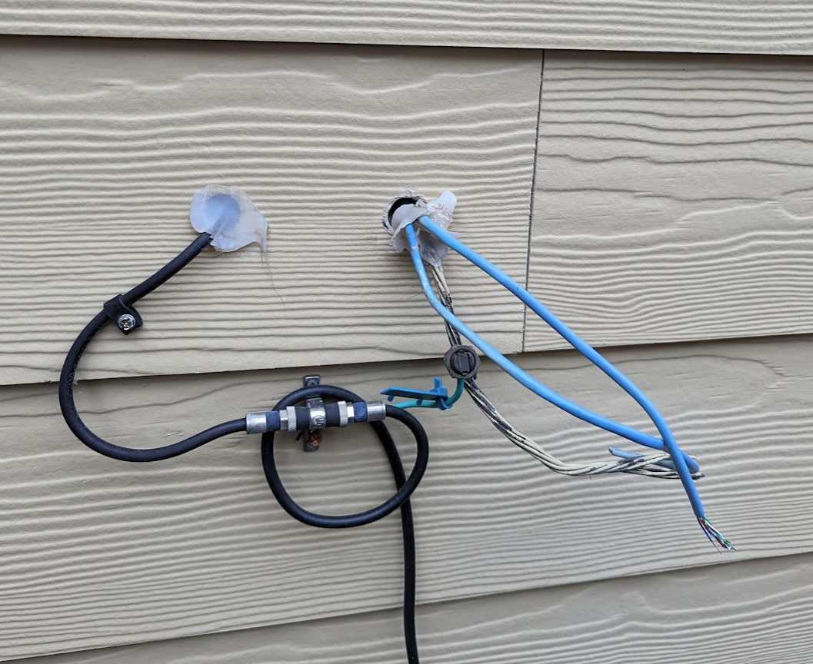

Apparently, I found was that since this was originally wired for phone service, this is where the phone service company was to come and hook things up to connect the rest of the house. You'll see only Comcast there. In other homes I have checked out, there's typically a telephony junction box. 

I managed to also 3D print some coax keystones to avoid buying a completely new keystone jack just for those combo ethernet/coax wallplates! This [model](https://www.printables.com/model/140425-coax-keystone-jack) worked out well. It's a bit soft with PLA, but it'll do.

## Post-upgrade

After doing the media enclosure, and each room and marking which is which, we have something like this:

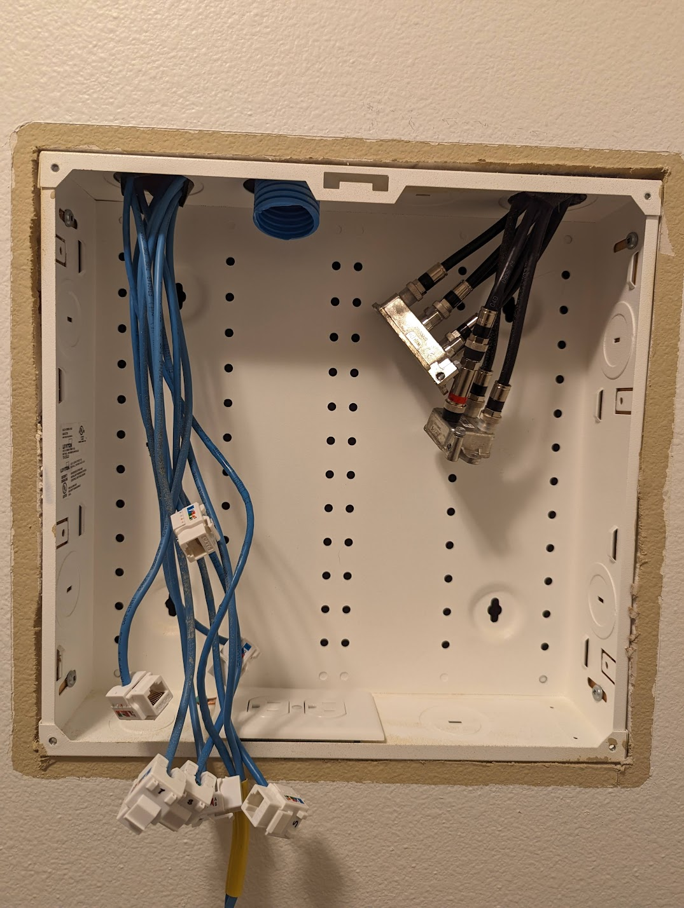

Tidying all the keystone jacks up with the patch panel and ~~shoving~~ arranging the wires around, then using cable ties to hook the panel into the enclosure, we get:

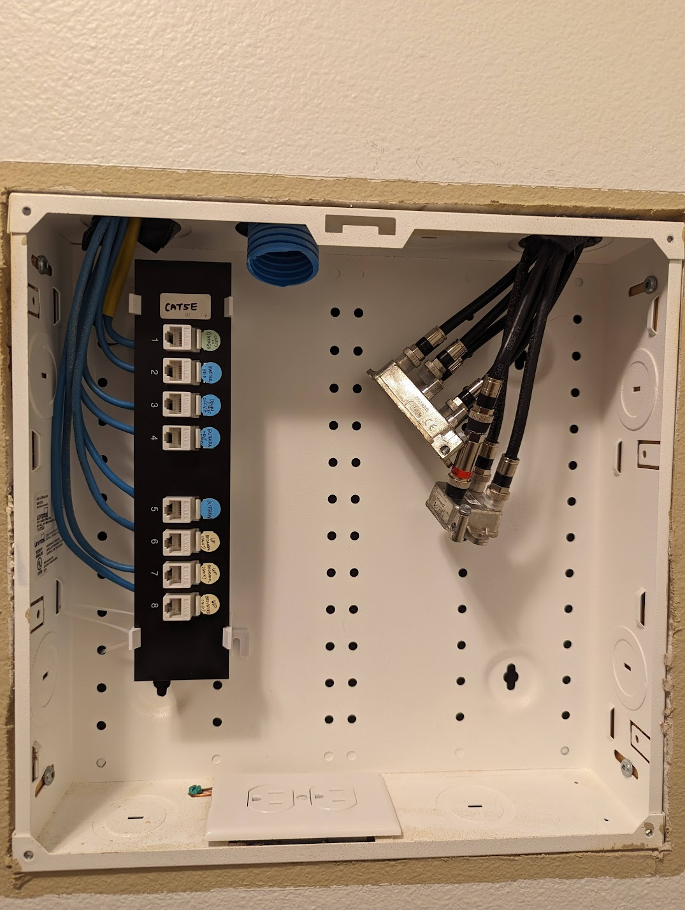

**Aesthetically pleasing**! A pro-tip here is to use some cable zip ties and loop through the holes to secure the patch panel, if you didn't buy the original Leviton branded one that fits.

OK now the fun part! After connecting up two of the mesh routers via wired backhaul in different rooms..

> *Note: I was going to add a switch to the mix in the earlier planning, but to be faithful to the initial setup and not add another bottleneck or influence the setup, I decided to just connect two routers together using the new ethernet jacks in the rooms and patch them together using a short LAN cable. i.e The same effect as running one long cable between 2 routers on each floor, with a much better wife acceptance factor compared to an ugly exposed run. I added benchmarks with a 2.5GbE switch at the end!*

Checking [`http://192.168.1.1/sysinfo.cgi`](http://192.168.1.1/sysinfo.cgi):
```

sysevent get backhaul::status
up
sysevent get icc_internet_state
up
sysevent get backhaul::intf

sysevent get backhaul::media
0
```

Oddly, it still shows as there's no wired backhaul. I do see this in the logs:

```
May 25 18:58:06 nodes local7.notice UTOPIA: service.status Subscriber: Generate system event "backhaul::status_data" = "/tmp/msg/BH/B4ADCDCF-0A90-4895-BE04-1491828E6DF4/status" [ 716452415 ]
May 25 18:58:06 nodes local7.notice UTOPIA: node-mode.STATUS backhaul::status_data /tmp/msg/BH/B4ADCDCF-0A90-4895-BE04-1491828E6DF4/status trying to send parent IP to slave
May 25 18:58:06 nodes local7.notice UTOPIA: node-mode.BH-STATUS WIRED Node B4ADCDCF-0A90-4895-BE04-1491828E6DF4 @192.168.1.133 is up
```

The tests show a different story though, and this is where I'm glad I collected metrics so I can tell if something changed!


## Testing with Wired backhaul

- Device: 
    - Client - Laptop, Acer Chromebook 516 (using Wifi)
    - Server - Rock5 SBC I have running as my server, with NVME storage. (Ethernet port of mesh router)
- Backhaul Connection Type: Wired

### Test: iperf

```
leewc@penguin:~$ iperf3 -c 192.168.1.2
Connecting to host 192.168.1.2, port 5201
[  5] local 100.115.92.201 port 43110 connected to 192.168.1.2 port 5201
[ ID] Interval           Transfer     Bitrate         Retr  Cwnd
[  5]   0.00-1.00   sec  46.5 MBytes   390 Mbits/sec    0   2.20 MBytes       
[  5]   1.00-2.00   sec  45.0 MBytes   377 Mbits/sec    3   2.29 MBytes       
[  5]   2.00-3.00   sec  46.2 MBytes   388 Mbits/sec    1   1.72 MBytes       
[  5]   3.00-4.00   sec  47.5 MBytes   398 Mbits/sec    2   1.29 MBytes       
[  5]   4.00-5.00   sec  50.0 MBytes   419 Mbits/sec    0   1.36 MBytes       
[  5]   5.00-6.00   sec  47.5 MBytes   398 Mbits/sec    0   1.42 MBytes       
[  5]   6.00-7.00   sec  45.0 MBytes   377 Mbits/sec    0   1.45 MBytes       
[  5]   7.00-8.00   sec  45.0 MBytes   378 Mbits/sec    0   1.47 MBytes       
[  5]   8.00-9.00   sec  46.2 MBytes   388 Mbits/sec    0   1.49 MBytes       
[  5]   9.00-10.00  sec  46.2 MBytes   388 Mbits/sec    0   1.49 MBytes       
- - - - - - - - - - - - - - - - - - - - - - - - -
[ ID] Interval           Transfer     Bitrate         Retr
[  5]   0.00-10.00  sec   465 MBytes   390 Mbits/sec    6             sender
[  5]   0.00-10.06  sec   463 MBytes   386 Mbits/sec                  receiver
```

**Speeds have jumped from 123 Mbits on the "wireless backhaul, wireless client" test to 232 Mbits "wireless backhaul, wired client" and now to 390 Mbits (wired backhaul, wireless client). Almost double!** Though interestingly the iperf default test has higher transfer now too.

And with parallel `4`:

```
- - - - - - - - - - - - - - - - - - - - - - - - -
[ ID] Interval           Transfer     Bitrate         Retr
[  5]   0.00-10.00  sec   130 MBytes   109 Mbits/sec   30             sender
[  5]   0.00-10.06  sec   128 MBytes   107 Mbits/sec                  receiver
[  7]   0.00-10.00  sec   128 MBytes   108 Mbits/sec   31             sender
[  7]   0.00-10.06  sec   126 MBytes   105 Mbits/sec                  receiver
[  9]   0.00-10.00  sec   123 MBytes   103 Mbits/sec   17             sender
[  9]   0.00-10.06  sec   120 MBytes   100 Mbits/sec                  receiver
[ 11]   0.00-10.00  sec   184 MBytes   155 Mbits/sec   64             sender
[ 11]   0.00-10.06  sec   181 MBytes   151 Mbits/sec                  receiver
[SUM]   0.00-10.00  sec   565 MBytes   474 Mbits/sec  142             sender
[SUM]   0.00-10.06  sec   556 MBytes   464 Mbits/sec                  receiver

```

### Test: Download a file from plex

A healthy 62-69 MB/s!


### Test: Ping

```
$ ping 192.168.1.2
--- 192.168.1.2 ping statistics ---
15 packets transmitted, 15 received, 0% packet loss, time 14024ms
rtt min/avg/max/mdev = 2.438/4.369/6.040/1.064 ms
```

That's better, from the original wireless setup (rtt min/avg/max/mdev = 7.281/9.743/13.996/1.900 ms) vs wired client (rtt min/avg/max/mdev = 5.033/6.344/8.748/1.036 ms) we have brought down the average from 9ms to 4ms. 

Unfortunately I can't faithfully run the test with a wired client as my router has only 2 ethernet ports, and it's all taken up now[^2].


# Summary

So after all this tinkering and wiring, I have faster local network speeds now, and reduced ping. The bottleneck is now likely at the router. I'll hopefully update this post when I get to try Moonlight working (I tested it with Sunshine and Nvidia GameStream (I am on a very old version) but DOOM Eternal streamed over to another device that is also hard-wired was iffy. Video locks up after 5 minutes despite removing sleep etc). 

Wired is always better than wireless, and the numbers don't lie!

My internet is still 100Mbps up and down for the fiber though[^3].


Even though Cloudflare did report `371` Mbps download. Now at least local network transfers are super charged!


## Bonus - 2.5GbE Switch and PoE shenanigans

Initially I was going to just keep my router downstairs and plug the router into a nearby ethernet outlet, but it turns out the area with the router doesn't have an ethernet jack! For context, when I moved in I had the tech from my ISP (Ziply) do a fiber run around the house from the demarc area to the living room so that I can position my then router in an optimal position. 


(Yes, that is my old college laptop that was going through retirement as a home server before the SBC replaced it)

Now given there's no nearby outlet and I don't want to do an exposed ethernet cable run, I had to relocate the ONT (Optical Network Terminal). The second constraint is that downstairs, there's limited places where I can feed in the fiber. The garage was the next best place.

My initial plan was to remove some of the fiber runs and then feed the fiber from the demarc into the garage (the technician wanted to put it there at first, but I didn't want my garage having the best signal and my living room not), then having the router plugged into the ethernet jack. Remember that one random ethernet run that was outside? I was going to bring that back into the garage and hook everything up and put it inside a box to avoid spiders making it their home.

But, this proved harder, I could never cut the drywall in the right location to find the wire drop. I think it's because it's behind the particle board. I made a total of 4 square holes and couldn't find the cable, even after using a [cable tracker](https://www.harborfreight.com/media/catalog/product/cache/9fc4a8332f9638515cd199dd0f9238da/i/m/image_14847.jpg).

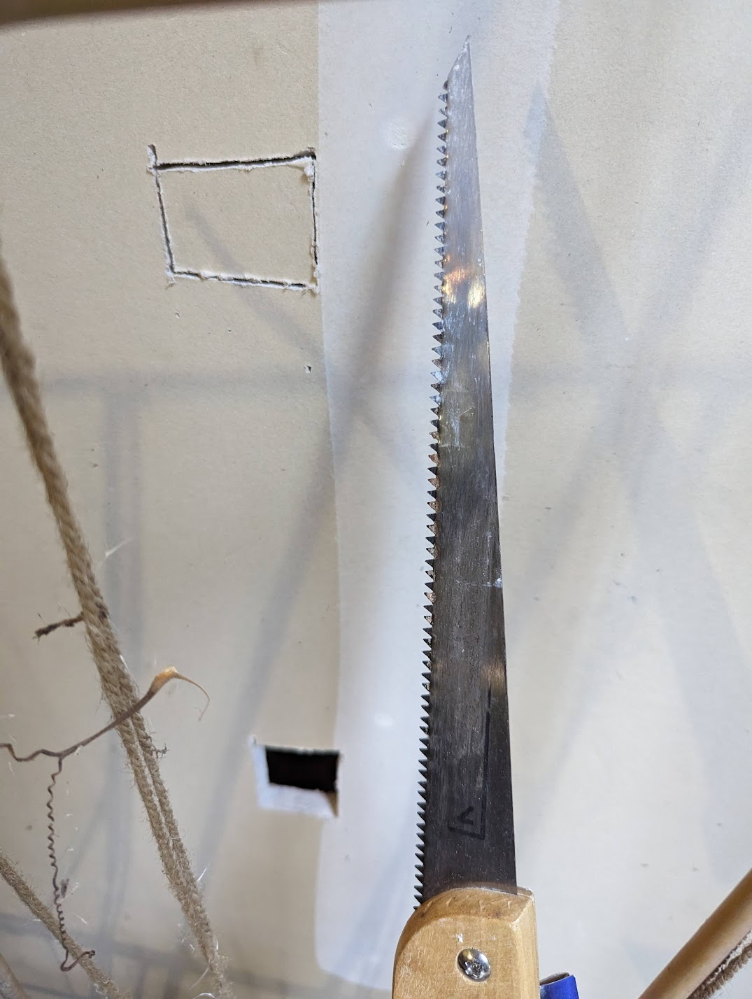

To avoid causing further damage to the garage wall I decided to change my plan. With no external power socket, I had to use Power over Ethernet to power the ONT. I can do this buy using a switch with PoE enabled. However, given that the ONT must directly connect to a router, and not the switch, I was lucky that there were two ethernet cables in that run. I would use one to power the ONT, and the other one to connect the ONT to the router!

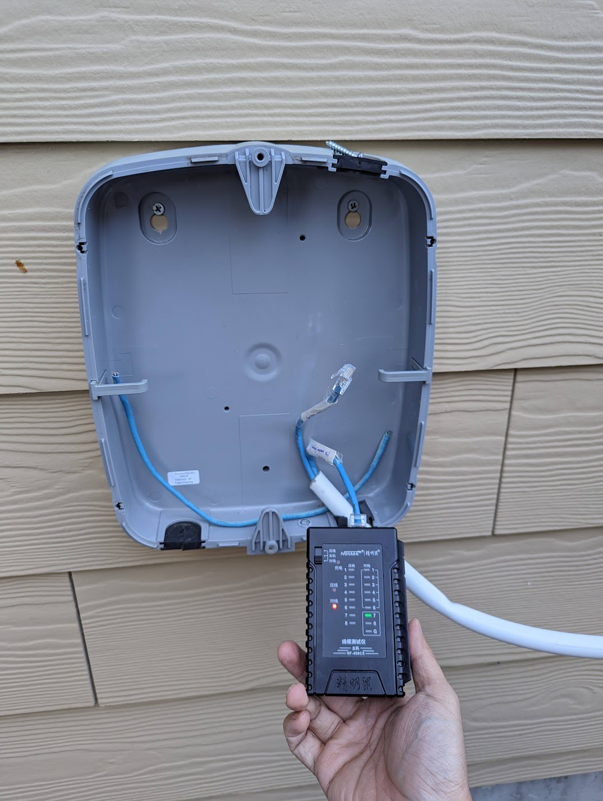


For the switch, I realized that I was lucky enough to have Cat5E and not just Cat5 cabling. While it is rated for gigabit speed, we can technically go higher up to 2.5 gbE! Since my SBC supports that, I went a bit overkill. After reading the [ServeTheHome Cheap Fanless 2.5GbE guide](https://www.servethehome.com/the-ultimate-cheap-2-5gbe-switch-mega-round-up-buyers-guide-qnap-netgear-hasivo-mokerlink-trendnet-zyxel-tp-link/) I managed to snag a TEROW 2.5gbE POE switch that is unmanaged off ebay for $50 (it was around 90 on Amazon) and it comes with POE. I decided to take a bet on no name brands given these are unmanaged switches and use a reference Realtek board in all of them anyway.

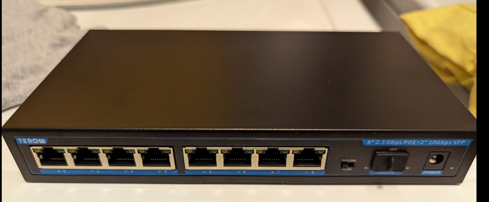

Putting in an outdoor enclosure, and terminating the cable run I then had to move my ONT. I also had to purchase a PoE splitter and some barrel plug converters (and snip the original cable head off as it was Molex like). I was hesitant of this but thanks to this Reddit post I gained the courage: https://www.reddit.com/r/ZiplyFiber/comments/urge9y/ont_power_supply/ 

With the parts off AliExpress (as POE is typically 44V-57V I also ordered a step down converter in an effort to power a Wyze cam that runs off 5V), and then snipping off the head...

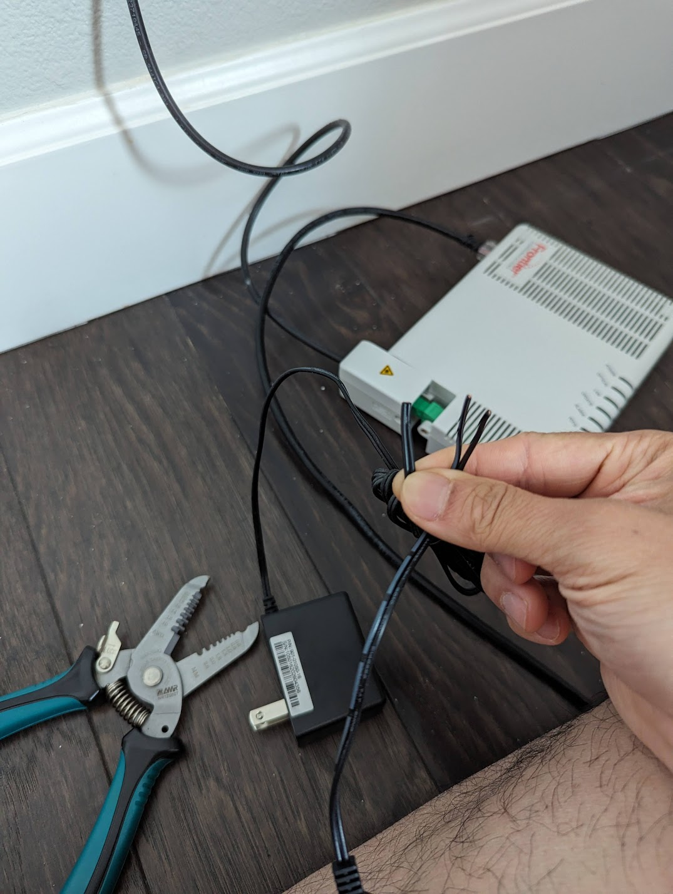

We now have..

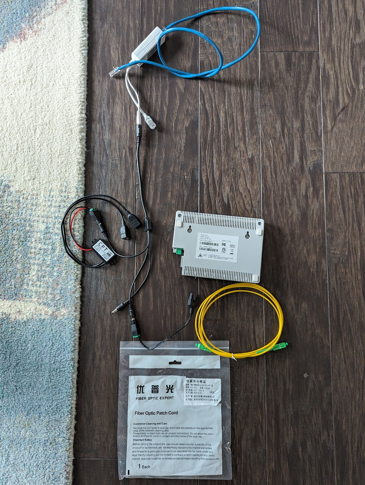

Which fit just fine when I relocated the ONT (I got a shorter APC fiber cable as well)

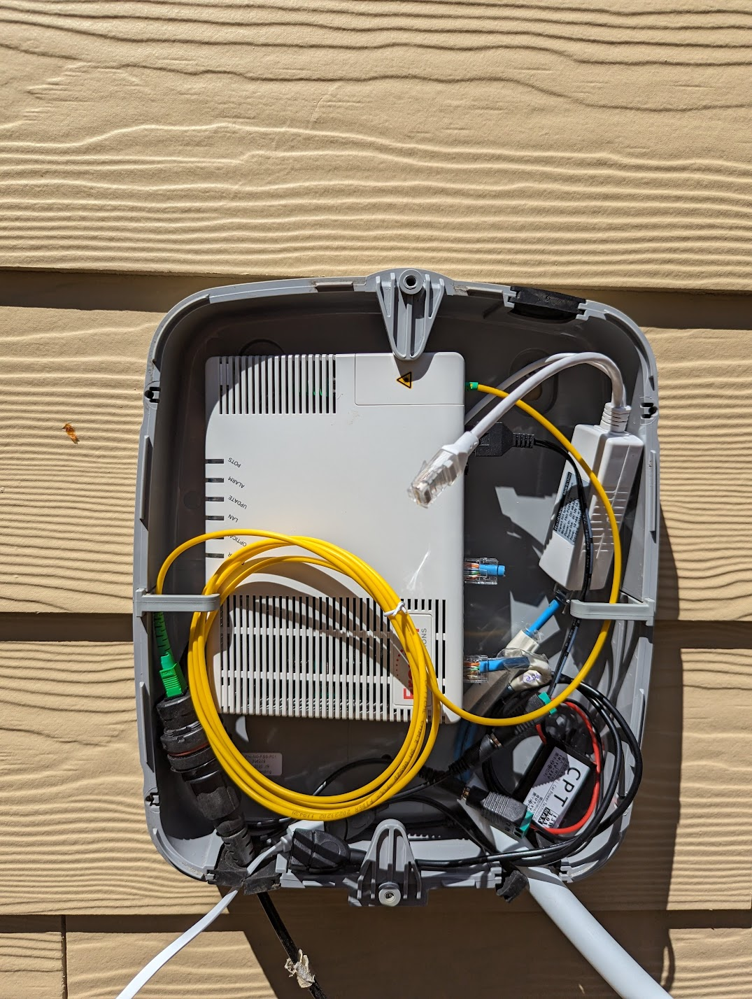

It's a little tight, and I had to tidy it up with velcro, but it works. All tidy now:

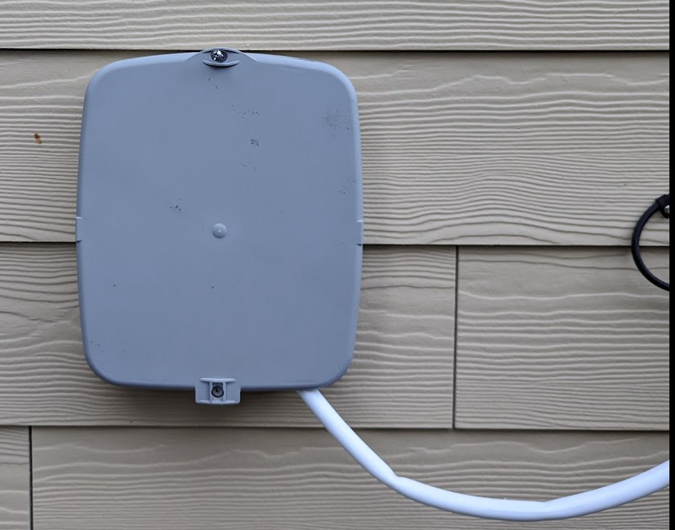

On the structured media enclosure, we now have a switch that can connect all rooms: 

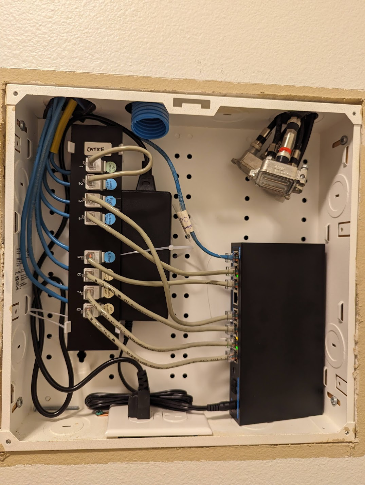

(Note the 1 and 2 jacks were joined because I wanted to host the mesh router in a separate room, rather than in the box itself. I'll move a dedicated router inside this enclosure if I ever need to upgrade to multigig Internet.)

With this, the setup is now:

```
ISP (outdoor) --> FTTH/ONT (outdoor - PoE powered) 
                    |--> Passthrough to Mesh Router (upstairs, ethernet)
                
                    |--> 2.5gbE Switch 
                            |--> Mesh Router (downstairs, wireless backhaul) 
                            |--> Server (Rock5 SBC, ethernet)
```

I'd prefer if the ONT went to the router in the structured media enclosure, then I can hook up the router to the switch directly, instead of now relying on the wireless backhaul still, but I don't want to put a mesh router in an enclosed metal box, basically a Faraday cage. I'll upgrade it someday. This way at least we have high speed switching on local network.

## Bonus Speed Test

Excited this saga is almost over, I attempted a file download, interestingly, it was slooow. 


Only 47.5 MB/s? What gives, 2.5gbE should be around 300 Mb/s (convert 2500 mbps to MB/s). I later found out I had a been using an old Cat5 (not Cat5e) cable between my home server and the wall. Networking really is only as fast as the weakest link. Swapping that out and `iperf` shows the max between client and server!

```
leewc@penguin:~$ iperf3 -c 192.168.1.2
Connecting to host 192.168.1.2, port 5201
[  5] local 100.115.92.201 port 60328 connected to 192.168.1.2 port 5201
[ ID] Interval           Transfer     Bitrate         Retr  Cwnd
[  5]   0.00-1.00   sec   242 MBytes  2.03 Gbits/sec    0   3.15 MBytes       
[  5]   1.00-2.00   sec   241 MBytes  2.02 Gbits/sec    0   3.15 MBytes       
[  5]   2.00-3.00   sec   242 MBytes  2.03 Gbits/sec    0   3.15 MBytes       
[  5]   3.00-4.00   sec   241 MBytes  2.02 Gbits/sec    0   3.15 MBytes       
[  5]   4.00-5.00   sec   240 MBytes  2.01 Gbits/sec    0   3.15 MBytes       
[  5]   5.00-6.00   sec   238 MBytes  1.99 Gbits/sec    0   3.15 MBytes       
[  5]   6.00-7.00   sec   244 MBytes  2.04 Gbits/sec    0   3.15 MBytes       
[  5]   7.00-8.00   sec   240 MBytes  2.01 Gbits/sec    0   3.15 MBytes       
[  5]   8.00-9.00   sec   236 MBytes  1.98 Gbits/sec    0   3.15 MBytes       
[  5]   9.00-10.00  sec   240 MBytes  2.01 Gbits/sec    0   3.15 MBytes       
- - - - - - - - - - - - - - - - - - - - - - - - -
[ ID] Interval           Transfer     Bitrate         Retr
[  5]   0.00-10.00  sec  2.35 GBytes  2.02 Gbits/sec    0             sender
[  5]   0.00-10.05  sec  2.35 GBytes  2.01 Gbits/sec                  receiver
```

With `-P 4`:

```
- - - - - - - - - - - - - - - - - - - - - - - - -
[ ID] Interval           Transfer     Bitrate         Retr
[  5]   0.00-10.00  sec   619 MBytes   519 Mbits/sec    0             sender
[  5]   0.00-10.08  sec   619 MBytes   515 Mbits/sec                  receiver
[  7]   0.00-10.00  sec   588 MBytes   493 Mbits/sec    0             sender
[  7]   0.00-10.08  sec   587 MBytes   489 Mbits/sec                  receiver
[  9]   0.00-10.00  sec   566 MBytes   475 Mbits/sec    0             sender
[  9]   0.00-10.08  sec   566 MBytes   471 Mbits/sec                  receiver
[ 11]   0.00-10.00  sec   647 MBytes   543 Mbits/sec    0             sender
[ 11]   0.00-10.08  sec   647 MBytes   538 Mbits/sec                  receiver
[SUM]   0.00-10.00  sec  2.36 GBytes  2.03 Gbits/sec    0             sender
[SUM]   0.00-10.08  sec  2.36 GBytes  2.01 Gbits/sec                  receiver
```

Now downloading that file again, we see a sweet `139 MB/s`. While there's no router in the mix beyond finding the route of client to server, I think the bottleneck still exists somewhere. More tests to follow, but this is a win in my book.


If you made it to the end, thank you for reading and your time!


[^1]: It all started from how I can upgrade an existing phone jack to an ethernet jack late Friday night, then a couple videos [https://www.youtube.com/watch?v=ieBbbkXPO2U](https://www.youtube.com/watch?v=ieBbbkXPO2U) and [https://www.youtube.com/watch?v=0euB3nAe6qI](https://www.youtube.com/watch?v=0euB3nAe6qI) and [https://www.youtube.com/watch?v=HYl1W8bN1fQ&t=97s](https://www.youtube.com/watch?v=HYl1W8bN1fQ&t=97s)...Rabbit hole!

[^2]: I had a 5 port switch but no power supply. So I went ahead and purchased one that was 2A thinking the device would only pull what it needs. I accidentally fried it when I fed a 2 amp and 3 amp power supply to it. At 2A It would reboot all the time, then unluckily the nearby power supply I had was for an audio amp, which is 3A. Plugging it in I heard a whine noise, followed by a *pop*, and some smell of burnt electronics coming up (magic smoke). RIP little switch.

[^3]: Because I'm cheap and there's no need in this household to top that. The upload has really helped in video conference meetings (Amazon Chime) where others have trouble due to Comcast cable internet.


