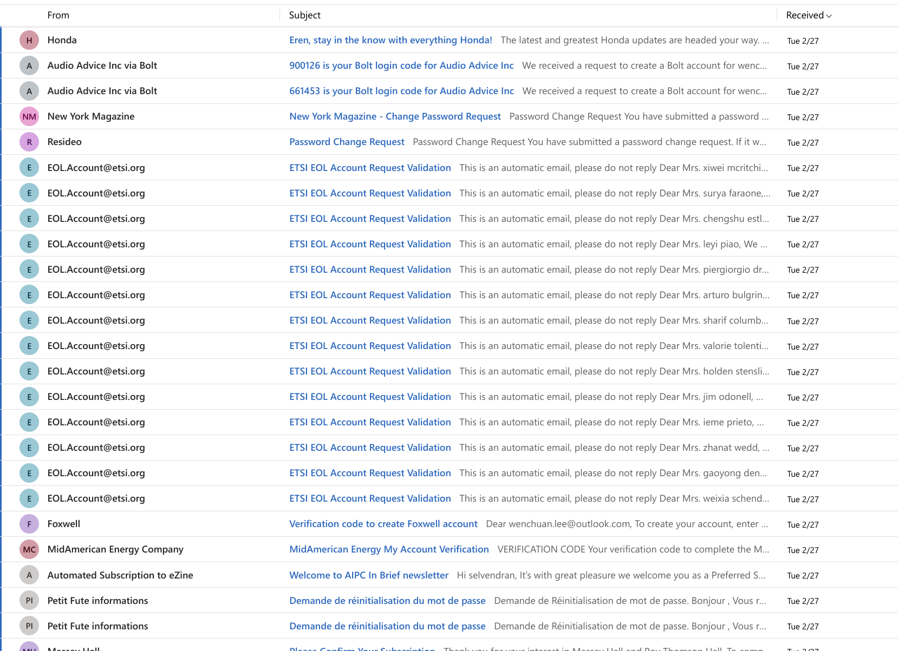
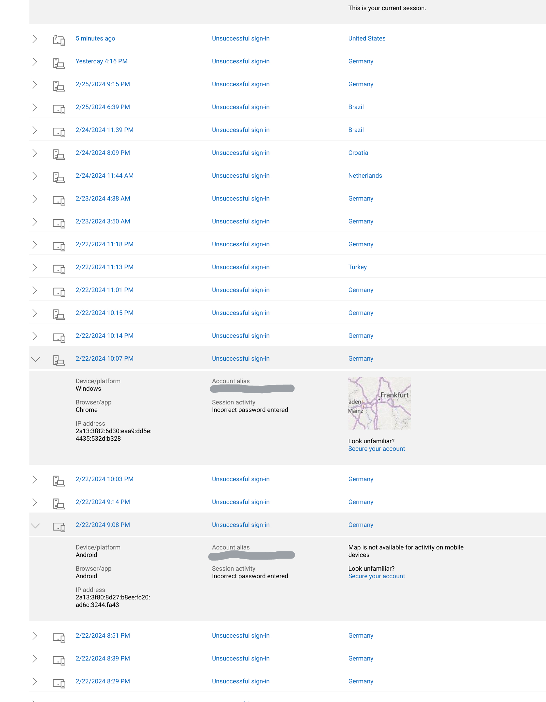
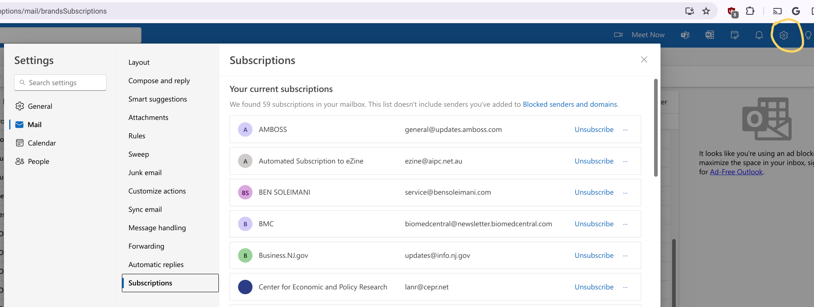

---             
title: Getting your email inbox stuffed with spam
excerpt: Why tho?
modified:
tags: [email, spam, cybersec]        
image:          
    path: /images/blog/2024-03-03-email-inbox-stuffing-2.png
    thumbnail: /images/blog/spam.png
date: 2024-03-03        
---            

I was finishing up a very long work day, when I noticed that my Gmail app notified me that received a lot of emails in a span of 4 hours.

Initially I didn't think too much about it, probably LinkedIn (their defaults send a ton of mail). Then I noticed it's my personal outlook email account, and not the typical email account I use. Like most of the people I know, majority of us have multiple email addresses, and I also think it's a good idea to have a separate email address just for the banking and financial apps, it reduces the likelihood of someone getting hold of your email address when you inevitably sign up for a newsletter to get free items or perks. There's too many places that need your email address these days. 

> It's my personal outlook email account, not the typical email account I use.

As far as I remember, this email was only used for certain financial apps and LinkedIn, as well as to log into a Microsoft account. However, upon opening the mailbox, it looks like I have over 2000 unread in the last few hours!

Taking a look at the random emails I get, it looks like there's a bot signing me up to a ton of email subscriptions.

I wasn't sure exactly why they were signing me up for spam, intuition was that they were trying to brute force my email account to get access to my financial logins, a very common attack is to break into your email account, then start performing password resets on other websites to get access to your accounts (and then ruin your life if it's a financial account).

But then why sign me up to so many mailing lists? 

Then it turns out from [Reddit](https://www.reddit.com/r/Scams/comments/hy9piy/psa_if_you_suddenly_receive_an_influx_of/), it's because they want to cover up their attempts. A non-tech person will just get overwhelmed with a bunch of spam email and not realize that someone is trying to break into their account. Which could result in them changing their passwords and enabling 2 factor auth (2FA).

Once I knew what was happening, that's what I did: Change my password just to be sure and enable 2FA! 

After checking my financial accounts, it turns out they were really just trying to brute force my Microsoft account:

The attacks were from many many countries (Germany, Turkey, Russia, China, India, Singapore). I wonder where they got my email, must have been a leak from a financial app or emails harvested from MSFT.

It's still happening even today! Checking the recent activity tab shows attempts from all over the world. See if you have any if you have a Microsoft Account here: https://account.live.com/Activity

But, the problem of spam is still there. 2 weeks since this has happened, I'm still getting random emails from websites I don't care about. 

Luckily, Microsoft has a feature that allows you to see all subscriptions (Gear icon > Mail (left side) > Subscriptions):

Which helped a bit. For the others, I'm still manually tapping unsubscribe like an animal even till today. Some of the unsubscribe links do not work, so not only are they in GDPR violation, I'm just going to mark it as spam. If I get too annoyed I guess it's time for a new email account. 

The sweep function on outlook is really nice though! It's always good to try a different email provider out.

### What did we learn from this

I guess the next time this happens, I could add a rule to immediately filter all to trash, but I would probably miss actual emails. It's kind of interesting that once your email is out there, there's not a lot you can do to avoid email. I did appreciate that some maling lists require an extra opt-in by clicking 'subscribe' in the email though before receiving their newsletters. These are the exception to the norm, given that it's more friction to opt-in. I didn't know a harmless newsletter setup by so many websites would be used by bots to spam others, so I'll make sure to add some friction on subscribing to my email list if I ever make one for this blog, or whatever side project.

